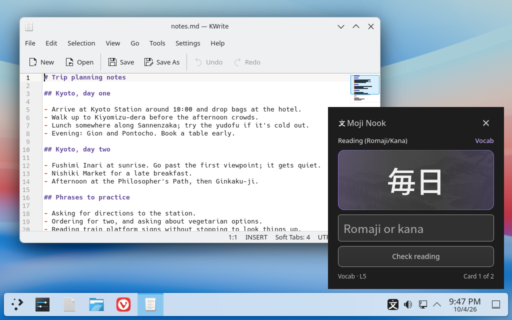

# Asterith Ulala

I build small desktop apps that solve problems in my own life, then share them.

## Moji Nook

**Short Japanese practice cards in the corner of your screen while you work,
read, or play.** Moji Nook quizzes you on the kanji and vocabulary you've
already learned in WaniKani, a couple of cards at a time, without taking
keyboard focus. Offline Japanese pronunciation included.

Early alpha for Linux, with an experimental Windows build. WaniKani is the
focus for now; simple Anki support is a work in progress.
[Download it](https://github.com/AsterithUlala/moji-nook/releases) or
[read more](https://github.com/AsterithUlala/moji-nook). An independent
project, not affiliated with WaniKani or Anki.

If you'd like to support my work, you can
[buy me a coffee](https://buymeacoffee.com/asterithulala).
